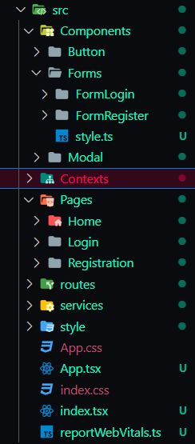

# Documentação do Projeto Final - React Sports

## Idioma do codigo

- Inglês

## Linguagens utilizada

- JavaScript/TypeScript

## Biblioteca principal utilizada

- React.js

## Bibliotecas secundarias utilizadas

- axios
- styled-components
- adicionar todas que forem utilizadas

## Modelo de Organização das Pastas

### src

    Contém todos as pastas criadas para o projeto

### src/Components

    Contém somente os componentes criados para o projeto com styled-components
      - Caso o componente tenha mais de um modelo, eles deveram
        ser dividos em subpastas. que partilham o mesmo style

### src/Contexts

    Contém todos os contextos da aplicação

### src/Pages

    Contém as paginas da aplicação

### src/Routes

    Contém as definições de rotas da aplicação

### src/Services

    Contém as configurações do axios para requisições da api

### src/Validators

    Contém as validações como yup,resolver, schema

### src/Style

    Contém o estilo global da aplicação
        - Variaveis
        - Fontes
        - Reset

### src/Images

    Contém imagens locais utilizadas no projeto

## Conventional Branchs/Commits

### Branchs

##### Master:

    Branch padrão do repositório, só aceitará pull request da branch
    Develop ou de uma branch hotFix

##### Develop:

    Branch de desenvolvimento, todas as branchs de feature serão criadas apartir desta.

##### Feature:

    Branch usada para desenvolver uma nova funcionalidade. Essa
    branch só existem enquanto a funcionalidade está sendo
    desenvolvida, mas será excluida quando o merge for realizado
    para branch develop

##### HotFix:

    Branch para correções emergenciais da branch Master caso esta já
    esteja em produção nesse caso a branch Develop também deve ser
    atualizada, ou para correções emergenciais da branch Develop
    antes que está seja mergeada com a Master

### Commits

    Os arquivos deverão ser adicionados individualmente para serem
    commitados evitando o uso de git add .

##### feat:

     Commits, que adicionam um novo recurso

##### fix:

     Commits, que corrige um bug

##### refactor:

    Commits, que reescrevem/reestruturam seu código, porém não alteram nenhum comportamento

##### perf:

    são commits de refatoração especiais, que melhoram o desempenho

##### style:

    Commits, que não afetam o significado (espaço em branco,
    formatação, ponto e vírgula ausente etc.)

##### docs:

    Commits, que afetam apenas a documentação

##### build:

    Commits, que afetam componentes de compilação como ferramenta de
    compilação, pipeline ci, dependências, versão do projeto ...

##### chore:

    Commits, Utilizado na atualização para mudanças em ferramentas, configurações e bibliotecas. Atualizações que não ocasionam em alteração no código de produção.
